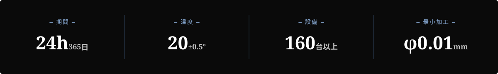
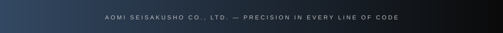

 

---

## About us

> 金属に「髪の毛より細い穴をあける」。金属を「紙より薄く削り出す」。

株式会社 青海製作所は、超精密切削加工を強みとするものづくり企業です。
医療機器・自動車・半導体・防衛／航空宇宙・光学などの先端分野向けに、試作から小ロットまで精密部品を製作しています。

このアカウントでは、その現場を支える **kintone を中心とした業務システム・DX** の開発を行っています。

---

## WHY AOMI

### `#1` Technology ── kintone カスタマイズ

- JavaScript / React による kintone アプリのカスタマイズ・プラグイン開発
- HTML / CSS による使いやすい画面・帳票デザイン
- REST API を使った外部システム・生産管理データとの連携
- 現場の工程・品質・設備情報をひとつのプラットフォームに集約

### `#2` Quality ── 品質へのこだわりをコードにも

> 加工段階で念入りな作りこみを重ね、絶対品質をもってお客様の信頼を頂く

ものづくりと同じ姿勢で、テスト・レビュー・ドキュメントを徹底しています。

### `#3` Equipment ── 使用技術

  
  
  
  
  

---

## Industries

| 医療 Medical | 自動車 Automotive | 半導体 Semi-Conductor | 防衛・航空・宇宙 Defense / Aerospace / Space | 光学 Optics |
| :---: | :---: | :---: | :---: | :---: |

---

## Performance

---

